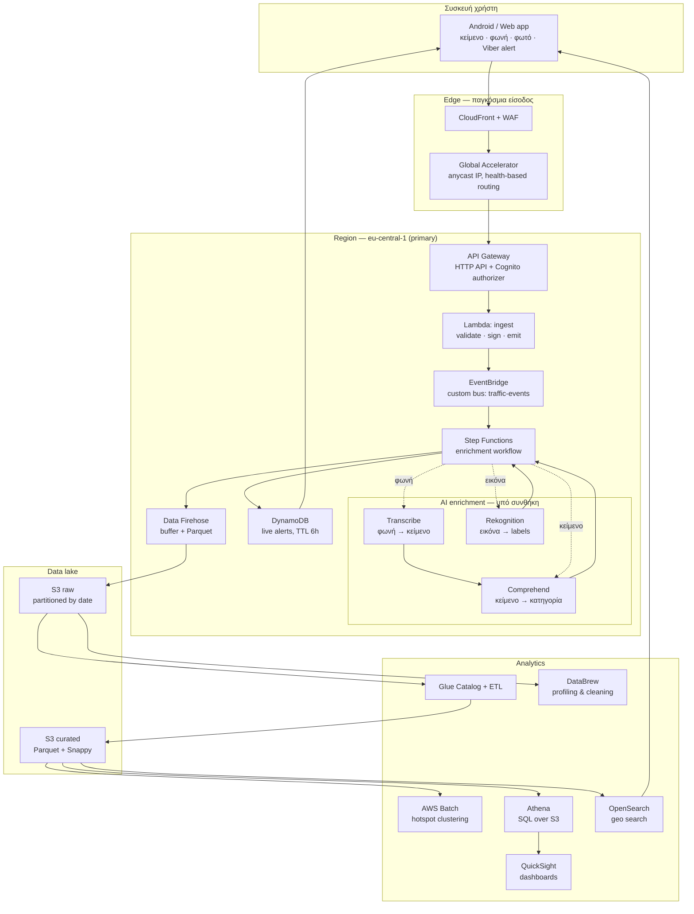

# 01 — Η αρχιτεκτονική end-to-end

## Η μία ροή

Όλα όσα ακολουθούν είναι **μία ροή**. Οι υπηρεσίες AI ενεργοποιούνται υπό
συνθήκη (ανάλογα με τον τύπο εισόδου), και η ανάλυση ιστορικού τρέχει εκτός της
live διαδρομής — αλλά η αλυσίδα είναι μία.



## Γιατί κάθε βήμα υπάρχει

Η ερώτηση που πρέπει να μπορείς να απαντήσεις για κάθε κουτί: **τι σπάει αν το
βγάλω;**

### CloudFront + WAF

- **Τι λύνει:** TLS termination στο edge, caching των GET (τα alerts διαβάζονται
  πολύ πιο συχνά απ' ό,τι γράφονται), rate limiting και geo-blocking πριν φτάσει
  το request στο API.
- **Αν το βγάλεις:** κάθε κινητό χτυπά απευθείας το API Gateway ανά 60 δλ. Με
  100 συσκευές αυτό είναι 144k requests/μέρα που θα μπορούσαν να είναι cache hits.
- **SA concept:** caching at the edge, origin shielding, WAF managed rule groups.

### Global Accelerator

- **Τι λύνει:** δύο σταθερές anycast IP που δεν αλλάζουν ποτέ, και αυτόματο
  failover σε δεύτερο Region μέσα σε δευτερόλεπτα βάσει health checks.
- **Πότε το θες αντί για Route 53:** όταν δεν αντέχεις DNS TTL. Το Route 53
  failover εξαρτάται από το πότε θα λήξει το TTL στον resolver του χρήστη — που
  μπορεί να μην τον σέβεται. Το Global Accelerator κάνει το failover στο δίκτυο,
  η IP δεν αλλάζει.
- **Αν το βγάλεις:** Route 53 health checks με χαμηλό TTL. Λειτουργεί, απλά πιο
  αργά και λιγότερο αξιόπιστα.
- **Κόστος:** ~26 €/μήνα σταθερά, ακόμα και με μηδέν κίνηση. Δες [`07-cost.md`](07-cost.md).

### API Gateway

- **Τι λύνει:** το σύνορο. Authentication (Cognito JWT authorizer), throttling
  ανά χρήστη, request validation με JSON Schema, usage plans.
- **HTTP API vs REST API:** εδώ HTTP API — ~70% φθηνότερο, χαμηλότερο latency,
  και δεν χρειαζόμαστε τα REST-only features (API keys per-method, request
  transformation με VTL, WAF integration στο ίδιο το API).
- **Το κρίσιμο σημείο:** εδώ σταματάει η ανάγκη για AWS credentials στο κινητό.
  Το κινητό κρατά ένα Cognito token, όχι IAM key.

### Lambda ingest

- **Τι λύνει:** μετατρέπει το ό,τι έστειλε η συσκευή σε **canonical event**
  (δες [`02-event-schema.md`](02-event-schema.md)), το επικυρώνει, και το βάζει
  στο EventBridge. Τίποτα άλλο.
- **Γιατί δεν κάνει το validation το Step Functions:** θέλουμε το API να
  απαντήσει `202 Accepted` σε <100ms. Ό,τι είναι αργό ή μπορεί να αποτύχει,
  γίνεται async μετά το EventBridge.
- **SA concept:** synchronous boundary vs asynchronous processing. Το πιο συχνό
  λάθος junior αρχιτεκτονικής είναι να κρατάει το HTTP request ανοιχτό μέχρι να
  τελειώσει όλη η επεξεργασία.

### EventBridge

- **Τι λύνει:** αποσυνδέει τον παραγωγό από τους καταναλωτές. Ο ingest δεν ξέρει
  —και δεν πρέπει να ξέρει— ποιος ενδιαφέρεται για ένα νέο alert.
- **Γιατί εδώ έχει νόημα:** ήδη σήμερα υπάρχουν πολλαπλές πηγές (Viber reader,
  χειροκίνητη αναφορά, Waze, TomTom) και θα υπάρξουν πολλαπλοί καταναλωτές
  (enrichment, archive, live push, μελλοντικά alerting). Αυτό είναι fan-out, και
  το fan-out με content-based routing είναι ακριβώς το EventBridge.
- **vs SNS:** το SNS κάνει fan-out αλλά το φιλτράρισμα είναι σε message
  attributes. Το EventBridge φιλτράρει σε **οποιοδήποτε πεδίο του payload**
  (`{"detail": {"alertType": ["accident"]}}`), έχει schema registry, archive και
  replay. Το replay μόνο του αξίζει: μπορείς να ξαναπαίξεις τα events μιας μέρας
  σε νέο consumer.
- **vs SQS:** το SQS είναι ουρά για έναν καταναλωτή με backpressure. Δεν είναι
  router.

### Step Functions

- **Τι λύνει:** ενορχηστρώνει μια ροή που έχει branching (τι τύπος input;),
  retries με exponential backoff ανά βήμα, error handling, και **ορατότητα** —
  βλέπεις γραφικά πού κόλλησε κάθε execution.
- **Standard vs Express:** εδώ Standard. Το Express είναι φθηνότερο και ταχύτερο
  αλλά κρατά ιστορικό μόνο στο CloudWatch Logs, με μέγιστη διάρκεια 5 λεπτά. Ένα
  Transcribe job μπορεί να χρειαστεί περισσότερο, και θέλουμε το πλήρες execution
  history για debugging.
- **Η ειλικρινής παρατήρηση:** με τον σημερινό όγκο, αυτό το workflow είναι 30
  γραμμές Lambda. Το Step Functions κερδίζει όταν τα βήματα είναι πολλά, αργά,
  και αποτυγχάνουν ανεξάρτητα — δηλαδή ακριβώς όταν μπουν τα Transcribe/
  Comprehend/Rekognition. Δες το ASL στο [`iac/step-functions-enrichment.asl.json`](iac/step-functions-enrichment.asl.json).

### DynamoDB

- **Τι λύνει:** το «δώσε μου τα ενεργά alerts κοντά μου», σε single-digit ms.
  Αντικαθιστά το Cloudflare KV.
- **Key design:**
  - PK = `geohash5` (κελί ~5km) — τα ερωτήματα είναι πάντα γεωγραφικά
  - SK = `observedAt#eventId` — φυσική ταξινόμηση κατά χρόνο μέσα στο κελί
  - TTL attribute = `expiresAt` — το DynamoDB σβήνει μόνο του μετά τις 6 ώρες,
    δωρεάν
- **Γιατί όχι RDS/Aurora:** δεν υπάρχει join, δεν υπάρχει transaction πάνω σε
  πολλαπλούς πίνακες, το access pattern είναι ένα και γνωστό. Αυτός είναι ο
  ορισμός του NoSQL use case.
- **SA concept:** single-table design, partition key cardinality, TTL ως
  μηχανισμός lifecycle αντί για scheduled delete job.

### Kinesis Data Firehose

- **Τι λύνει:** μαζεύει μεμονωμένα events και τα γράφει στο S3 σε batches, με
  αυτόματη μετατροπή σε Parquet, συμπίεση, και partitioning κατά ημερομηνία.
- **Γιατί όχι απευθείας `PutObject` από τη Lambda:** θα δημιουργούσε ένα μικρό
  JSON αρχείο ανά alert. Το Athena πάνω σε χιλιάδες μικρά αρχεία είναι αργό και
  ακριβό — το γνωστό *small files problem*. Το Firehose λύνει ακριβώς αυτό.
- **Η ειλικρινής παρατήρηση:** με 50 alerts/μέρα το buffer θα γεμίζει από τον
  χρόνο (900 δλ), όχι από το μέγεθος (128 MB). Δηλαδή 96 αρχεία/μέρα των λίγων
  KB. Το πρόβλημα δεν λύνεται τελείως — χρειάζεται και ένα Glue compaction job.
- **Firehose vs Kinesis Data Streams:** το Data Streams το θες όταν χρειάζεσαι
  πολλαπλούς ανεξάρτητους consumers με δικό τους ρυθμό, ordering ανά shard, ή
  replay από συγκεκριμένο σημείο. Εδώ έχουμε έναν προορισμό (S3), άρα Firehose:
  fully managed, μηδέν shard management, πληρώνεις μόνο ό,τι περνάει.

### S3 — δύο ζώνες

```
s3://maps-traffic-raw/       ← ό,τι ήρθε, ακριβώς όπως ήρθε (Firehose)
s3://maps-traffic-curated/   ← καθαρισμένο, Parquet, partitioned (Glue)
```

- **Γιατί δύο buckets:** το raw δεν το πειράζει ποτέ κανείς — είναι η πηγή
  αλήθειας. Αν αύριο αλλάξει η λογική καθαρισμού, ξαναχτίζεις το curated από το
  raw. Αυτό είναι το πιο σημαντικό pattern σε data lake.
- **Lifecycle:** raw → Glacier Instant Retrieval στις 90 ημέρες, curated μένει σε
  Standard. Object Lock στο raw αν χρειαστεί compliance.

### Το analytics κομμάτι

Αναλυτικά στο [`04-analytics.md`](04-analytics.md). Σε μία γραμμή:

- **Glue Catalog** — το «schema» πάνω από αρχεία S3. Χωρίς αυτό το Athena δεν
  ξέρει τι διαβάζει.
- **Glue ETL** — raw JSON → curated Parquet, compaction, deduplication.
- **DataBrew** — visual profiling. Τρέχεις ένα profile job και βλέπεις πόσα
  `alertType` είναι null, πόσα coordinates είναι εκτός Ελλάδας, ποιες τιμές
  εμφανίζονται πόσο συχνά. Χρήσιμο **μία φορά** στην αρχή, όχι σε κάθε alert.
- **Batch** — τα βαριά, προγραμματισμένα. Clustering συμβάντων σε hotspots
  (DBSCAN πάνω σε coordinates), εβδομαδιαία στατιστικά ανά διαδρομή.
- **Athena** — SQL. Πληρώνεις ανά TB που σαρώνει, γι' αυτό το partitioning και
  το Parquet έχουν άμεσο οικονομικό αντίκτυπο.
- **QuickSight** — τα διαγράμματα. SPICE cache για να μη χτυπάει το Athena σε
  κάθε refresh.
- **OpenSearch** — geo queries σε πραγματικό χρόνο (`geo_distance`), full-text
  αναζήτηση στα ελληνικά μηνύματα, και geo heatmap στο OpenSearch Dashboards.

## Τι αντικαθιστά τι από το σημερινό σύστημα

| Σήμερα (Cloudflare) | Στο AWS | Τι κερδίζεις |
|---|---|---|
| Worker `fetch` handler | API Gateway + Lambda | Auth, throttling, validation, tracing |
| `SHARED_KEY` σε header | Cognito JWT | Ανά χρήστη, ανακλήσιμο, με expiry |
| KV `items` (ένα κλειδί!) | DynamoDB με geohash PK | Ερωτήματα ανά περιοχή, όχι «φέρε τα όλα» |
| `MAX_AGE_MS` φίλτρο στον κώδικα | DynamoDB TTL | Το κάνει η υπηρεσία, δωρεάν |
| `MAX_ITEMS = 200` | Χωρίς όριο | Απεριόριστο ιστορικό στο S3 |
| Τίποτα | Glue → Athena → QuickSight | Ανάλυση που σήμερα είναι αδύνατη |

**Το πιο σοβαρό σημερινό πρόβλημα** που φαίνεται από αυτόν τον πίνακα: όλα τα
alerts είναι σε **ένα** KV κλειδί (`items`). Κάθε write ξαναγράφει ολόκληρη τη
λίστα. Αυτό είναι read-modify-write χωρίς κλείδωμα — δύο ταυτόχρονα POST και
χάνεις alerts. Ισχύει **τώρα**, ανεξάρτητα από AWS.

## Trade-offs που πρέπει να μπορείς να υπερασπιστείς

Σε συνέντευξη SA δεν ρωτούν «τι έβαλες». Ρωτούν «γιατί όχι το άλλο».

| Απόφαση | Η εναλλακτική | Πότε θα άλλαζα γνώμη |
|---|---|---|
| EventBridge | SNS | Αν το routing ήταν πάντα σε 1-2 σταθερούς προορισμούς χωρίς content filtering |
| Step Functions | Μία Lambda | Αν τα βήματα έμεναν 2-3 και γρήγορα — τότε η Lambda είναι απλούστερη και φθηνότερη |
| DynamoDB | Aurora Serverless v2 | Αν εμφανίζονταν σχεσιακά ερωτήματα (joins, ad-hoc filters σε πολλά πεδία) |
| Firehose | Lambda → S3 απευθείας | Αν ο όγκος έμενε <10 events/λεπτό *και* έμπαινε compaction job |
| Athena | Redshift Serverless | Αν τα δεδομένα ξεπερνούσαν τα ~1 TB και τα queries γίνονταν καθημερινά και σύνθετα |
| Global Accelerator | Route 53 failover | Αν το RTO ανεχόταν λεπτά αντί για δευτερόλεπτα — τότε γλιτώνεις 26 €/μήνα |
| Cognito | API keys | Ποτέ για end users. Τα API keys δεν ταυτοποιούν χρήστη και δεν ανακαλούνται ανά άτομο |

## Well-Architected — πώς κρίνεται αυτή η αρχιτεκτονική

Οι έξι πυλώνες, εφαρμοσμένοι εδώ:

- **Operational Excellence** — όλα ως IaC ([`iac/`](iac/)), structured logging,
  X-Ray tracing από API Gateway ως Step Functions.
- **Security** — δες [`05-security.md`](05-security.md). Καμία υπηρεσία δεν έχει
  δικαιώματα πέρα από αυτά που χρειάζεται· κρυπτογράφηση παντού με KMS.
- **Reliability** — δες [`06-resilience.md`](06-resilience.md). DLQ σε κάθε
  async βήμα, retries με backoff, multi-AZ εξ ορισμού σε managed services.
- **Performance Efficiency** — serverless παντού, άρα το scaling δεν είναι δικό
  μας πρόβλημα. Το edge caching κόβει το μεγαλύτερο μέρος του read traffic.
- **Cost Optimization** — δες [`07-cost.md`](07-cost.md). Parquet + partition
  pruning μειώνουν το κόστος Athena κατά ~95%. S3 lifecycle σε Glacier.
- **Sustainability** — serverless σημαίνει μηδέν idle compute. Το Graviton στη
  Lambda και το Batch είναι ~20% λιγότερη ενέργεια για την ίδια δουλειά.

Το να μπορείς να διατρέξεις μια αρχιτεκτονική ανά πυλώνα, φωναχτά, είναι
ουσιαστικά η άσκηση του exam.
