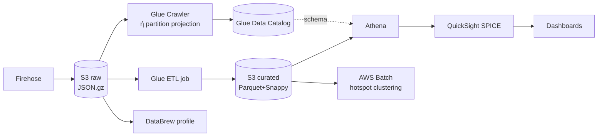

# 04 — Analytics: Glue → Athena → QuickSight

Το κομμάτι που δίνει τη μεγαλύτερη πραγματική αξία στο project, γιατί απαντά σε
ερωτήσεις που **σήμερα είναι αδύνατες**: το relay κρατά 6 ώρες και 200 alerts,
οπότε «ποιο σημείο έχει τα περισσότερα τροχαία;» δεν έχει απάντηση.

## Η αλυσίδα



## Glue Data Catalog

Ένας κατάλογος μεταδεδομένων: «στο path X υπάρχουν αρχεία με αυτά τα πεδία και
αυτούς τους τύπους». Δεν αποθηκεύει δεδομένα.

Το κρίσιμο: ο **ίδιος** κατάλογος διαβάζεται από Athena, EMR, Redshift Spectrum,
QuickSight και Glue ETL. Ορίζεις το schema μία φορά.

### Crawler vs Partition Projection

Ο crawler σαρώνει το S3 και ανακαλύπτει schema και partitions. Λειτουργεί, αλλά:

- κοστίζει ανά λεπτό εκτέλεσης,
- πρέπει να ξανατρέχει για κάθε νέο partition,
- μπορεί να «μαντέψει» λάθος τύπους.

Το **partition projection** (δες [`sql/01-create-tables.sql`](sql/01-create-tables.sql))
λέει στο Athena πώς να *υπολογίσει* τα partitions από το path, χωρίς κατάλογο
partitions:

```
projection.dt.type   = date
projection.dt.range  = 2026-01-01,NOW
storage.location.template = s3://.../dt=${dt}/hh=${hh}/
```

Μηδέν crawler, μηδέν `MSCK REPAIR`, μηδέν κόστος ανακάλυψης. Όταν το partitioning
είναι προβλέψιμο —ημερομηνία/ώρα, όπως εδώ— είναι σχεδόν πάντα η σωστή επιλογή.
Είναι από τα λιγότερο γνωστά και πιο χρήσιμα χαρακτηριστικά του Athena.

## Glue ETL: raw → curated

Το job κάνει τέσσερα πράγματα, με αυτή τη σειρά:

1. **Compaction** — τα ~96 μικρά αρχεία της ημέρας γίνονται 1-2 μεγάλα.
2. **Μετατροπή σε Parquet** — columnar. Ένα query που ζητά 3 στήλες διαβάζει 3
   στήλες, όχι ολόκληρες γραμμές.
3. **Καθαρισμός** — απόρριψη coords εκτός Ελλάδας, κανονικοποίηση `alertType`,
   υπολογισμός `lag_seconds`, `hour_of_day`, `day_of_week`, `is_rush_hour`.
4. **Deduplication** — window function πάνω σε `geohash7 + alertType`, κρατά την
   πρώτη εμφάνιση σε παράθυρο 10 λεπτών.

### Γιατί το Parquet αλλάζει το κόστος

Το Athena χρεώνει ~5 $/TB **σαρωμένων δεδομένων**. Για το ίδιο query:

| Μορφή | Σαρώνει | Σχετικό κόστος |
|---|---|---|
| JSON χωρίς συμπίεση | 100% | 100% |
| JSON + GZIP | ~20% | 20% |
| Parquet + Snappy | ~8% | 8% |
| Parquet + Snappy + partition pruning | ~1% | **1%** |

Δύο τεχνικές επιλογές, εκατονταπλάσια διαφορά κόστους. Αυτό είναι το είδος του
trade-off που το Cost Optimization pillar εξετάζει.

**Partition pruning** σημαίνει: το `WHERE dt >= '2026-08-01'` κάνει το Athena να
μη διαβάσει καν τους φακέλους των προηγούμενων μηνών. Γι' αυτό κάθε query στο
[`sql/02-analysis-queries.sql`](sql/02-analysis-queries.sql) ξεκινά με φίλτρο
partition. Ένα query χωρίς αυτό σαρώνει τα πάντα.

## Athena

Presto/Trino ως managed υπηρεσία. Serverless, χωρίς cluster, πληρωμή ανά query.

Τα έξι βασικά queries είναι στο [`sql/02-analysis-queries.sql`](sql/02-analysis-queries.sql):

1. **Hotspots** — γεωγραφική συγκέντρωση συμβάντων ανά κελί ~150m
2. **Χρονικό μοτίβο** — ώρα × ημέρα × τύπος, για heatmap
3. **Ποιότητα ανά πηγή** — το ποσοστό `OTHER` δείχνει πόσο καλά δουλεύει η
   κατηγοριοποίηση· είναι ο δείκτης με τον οποίο κρίνεται το Comprehend
4. **Duplicate detection** — πόσο διπλογράφονται οι αναφορές
5. **Ημερήσια τάση** — το κύριο γράφημα
6. **Έλεγχος υγείας** — τι μπήκε τις τελευταίες 24 ώρες, πόσα με κακά coords

### Πρακτικές που αξίζουν

- **`approx_percentile`** αντί για ακριβές percentile — τάξεις μεγέθους
  ταχύτερο, με σφάλμα αμελητέο για dashboard.
- **CTAS** (`CREATE TABLE AS SELECT`) για να υλοποιήσεις ένα βαρύ aggregation μία
  φορά και να το ρωτάς φθηνά πολλές.
- **Workgroups** με `BytesScannedCutoffPerQuery` — φράγμα ασφαλείας ώστε ένα
  λανθασμένο query να μη σαρώσει 10 TB.
- Το αποτέλεσμα κάθε query γράφεται στο S3. Χρειάζεται lifecycle rule, αλλιώς ο
  `athena-results` φάκελος μεγαλώνει για πάντα.

## QuickSight

### SPICE — το σημείο που παρεξηγείται

Το SPICE είναι in-memory columnar cache. Δύο τρόποι σύνδεσης:

- **Direct query** — κάθε αλληλεπίδραση στο dashboard τρέχει Athena query.
  Πάντα φρέσκο, αλλά κάθε φίλτρο που πατά ο χρήστης κοστίζει.
- **SPICE** — τα δεδομένα φορτώνονται περιοδικά στη μνήμη. Το dashboard είναι
  ακαριαίο και δεν χτυπά καθόλου το Athena.

Εδώ: **SPICE με ημερήσιο refresh**. Τα traffic analytics δεν χρειάζονται
δευτερόλεπτο ακρίβειας — για live δεδομένα υπάρχει το DynamoDB path.

Ο λόγος που αυτό μετράει: ένα dashboard σε direct query, με 10 χρήστες που
πειράζουν φίλτρα, παράγει εκατοντάδες Athena queries την ημέρα.

### Τα οπτικά που αξίζουν εδώ

| Visual | Δεδομένα | Τι δείχνει |
|---|---|---|
| Points on map | lat/lon + type | Πού συμβαίνουν |
| Heat map | hour × day_of_week | Πότε συμβαίνουν |
| KPI | events σήμερα vs χθες | Απόκλιση από το κανονικό |
| Horizontal bar | top 20 geohash7 | Τα χειρότερα σημεία |
| Line | ημερήσια τάση ανά τύπο | Εξέλιξη |
| Table | ποιότητα ανά πηγή | Ποια πηγή είναι αξιόπιστη |

**Προσοχή στο κόστος:** το QuickSight χρεώνει **ανά χρήστη ανά μήνα** (~3 $
reader, ~18 $ author στην Enterprise). Δεν είναι pay-per-use. Ένας author για
lab, και σβήσιμο της συνδρομής μετά — αλλιώς τρέχει επ' αόριστον.

## DataBrew — μία φορά, στην αρχή

Οπτικό data preparation χωρίς κώδικα. Η πραγματική αξία εδώ είναι το **profile
job**: το τρέχεις μία φορά πάνω στο raw και παίρνεις αναφορά με null ποσοστά ανά
στήλη, κατανομές τιμών, outliers, μοναδικές τιμές, συσχετίσεις.

Απαντά αμέσως σε ερωτήσεις όπως «πόσα alerts έχουν κενό `label`;» ή «πόσα
coordinates είναι στη μέση της θάλασσας;».

**Δεν είναι για την live διαδρομή.** Είναι εργαλείο εξερεύνησης. Χρεώνεται ανά
node-hour· τρέχεις το job, βλέπεις την αναφορά, τελείωσες.

## AWS Batch — τα βαριά, νυχτερινά

Το clustering συμβάντων σε hotspots δεν είναι query — είναι αλγόριθμος (DBSCAN
πάνω σε coordinates με απόσταση haversine). Τρέχει σε container, μία φορά τη
νύχτα, πάνω σε όλο το ιστορικό.

Γιατί Batch και όχι Lambda: το όριο των 15 λεπτών. Γιατί Batch με **Spot**: το
job μπορεί να διακοπεί και να ξανατρέξει, που είναι ο ορισμός του κατάλληλου
Spot workload — έως 90% έκπτωση.

Ενορχηστρώνεται με EventBridge scheduled rule (`cron(0 3 * * ? *)`) → Batch job.

## EMR και Redshift — πότε δικαιολογούνται

Κανένα από τα δύο δεν χρειάζεται εδώ. Το κατώφλι:

- **EMR** αν τα δεδομένα φτάσουν εκατοντάδες GB *και* το Glue ETL αρχίσει να
  αργεί ή να μην επαρκεί (custom Spark libraries, iterative ML, HBase).
- **Redshift** αν εμφανιστούν πολλοί ταυτόχρονοι BI χρήστες με σύνθετα joins σε
  >1 TB. Τότε το προ-φορτωμένο columnar storage κερδίζει το Athena.

Και τα δύο ως 🟡 lab: στήνεις, τρέχεις ένα job, μετράς, **σβήνεις**. Ένα ξεχασμένο
EMR cluster κοστίζει εκατοντάδες € τον μήνα — από τους πιο συχνούς τρόπους να
πάθει κάποιος bill shock.

## OpenSearch — η δεύτερη φάση

Ό,τι το Athena δεν κάνει καλά:

```json
{ "query": { "bool": {
    "must":   [{ "match": { "alert_text": "τροχαίο εγνατία" }}],
    "filter": [{ "geo_distance": {
        "distance": "2km",
        "location": { "lat": 40.6401, "lon": 22.9444 }
    }}]
}}}
```

Σωστό `geo_distance` (όχι geohash προσέγγιση με τους 8 γείτονες), full-text στα
ελληνικά με stemming, sub-second σε αυθαίρετα φίλτρα, και geo heatmap στο
OpenSearch Dashboards.

**Το κόστος είναι το θέμα:** ακόμα και το μικρότερο cluster τρέχει ~25 €/μήνα
σταθερά, γιατί είναι instance-based, όχι serverless. Γι' αυτό είναι φάση 2.

## Η σειρά υλοποίησης

1. Firehose γράφει στο raw (φάση 1, ήδη στο [`iac/01-ingest-stack.yaml`](iac/01-ingest-stack.yaml))
2. Athena table με partition projection πάνω στο raw
3. Το πρώτο query — ήδη έχεις αξία που σήμερα δεν υπάρχει
4. DataBrew profile: τι πρόβλημα έχουν τα δεδομένα
5. Glue ETL: raw → curated Parquet
6. Τα υπόλοιπα queries πάνω στο curated
7. QuickSight + SPICE
8. Batch clustering
9. OpenSearch, μόνο αν χρειαστεί γεωγραφική αναζήτηση σε πραγματικό χρόνο
