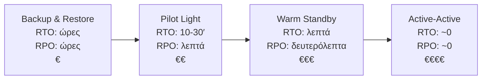
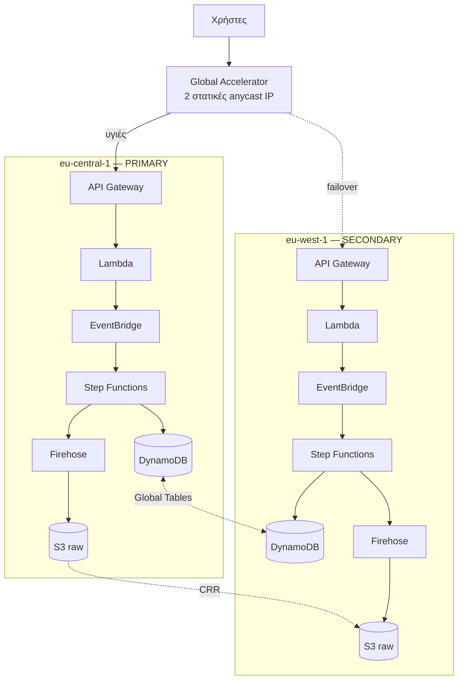

# 06 — Resilience, Multi-Region, Disaster Recovery

Το κεφάλαιο ξεκινά από δύο αριθμούς. Χωρίς αυτούς, κάθε συζήτηση για DR είναι
θεολογία.

## RTO και RPO

- **RTO** (Recovery Time Objective) — πόση ώρα αντέχεις να είναι κάτω.
- **RPO** (Recovery Point Objective) — πόσα δεδομένα αντέχεις να χάσεις.

Για **αυτό** το project, ειλικρινά:

| | Τιμή | Γιατί |
|---|---|---|
| RTO | 4 ώρες | Είναι βοηθητική εφαρμογή. Ο χρήστης έχει Waze/Google Maps |
| RPO | 1 ώρα | Τα alerts ούτως ή άλλως λήγουν σε 6 ώρες |

Με αυτούς τους αριθμούς, **δεν χρειάζεται multi-region**. Backup & Restore
επαρκεί, και κοστίζει σχεδόν μηδέν.

Το λέω ρητά γιατί είναι η σωστή αρχιτεκτονική απάντηση, και το πιο συχνό λάθος
είναι να χτίζεται multi-region επειδή ακούγεται σοβαρό. Ό,τι ακολουθεί είναι
**εκπαιδευτικό** — τι θα έκανες αν το RTO ήταν 5 λεπτά.

---

## Οι τέσσερις στρατηγικές DR

### 1. Backup & Restore — RTO ώρες, RPO ώρες

Τίποτα δεν τρέχει στο δεύτερο region. Κρατάς backups και IaC.

- S3 Cross-Region Replication για τα raw δεδομένα
- DynamoDB point-in-time recovery + AWS Backup cross-region
- Το CloudFormation template είναι σε git

Σε καταστροφή: `sam deploy` στο δεύτερο region, restore, αλλαγή DNS.

**Αυτή είναι η σωστή επιλογή για το Maps-Traffic.** Κόστος: μόνο η αποθήκευση
των αντιγράφων, λίγα λεπτά του €.

### 2. Pilot Light — RTO 10-30′, RPO λεπτά

Τα **δεδομένα** ρέουν συνεχώς, το **compute** είναι σβηστό.

- DynamoDB Global Table (συνεχής replication)
- S3 CRR ενεργό
- Lambda/API Gateway υπάρχουν αλλά χωρίς κίνηση
- Route 53 δείχνει μόνο στο primary

Σε καταστροφή: ενεργοποιείς το routing. Ο κώδικας είναι ήδη εκεί.

Η αναλογία: η φλόγα του θερμοσίφωνα καίει, αλλά ο καυστήρας δεν δουλεύει.

### 3. Warm Standby — RTO λεπτά, RPO δευτερόλεπτα

Πλήρες αντίγραφο σε μικρότερη κλίμακα, που δέχεται ήδη λίγη κίνηση. Ξέρεις ότι
δουλεύει, γιατί το βλέπεις να δουλεύει. Σε καταστροφή, κάνεις scale up.

**Το κρίσιμο πλεονέκτημα:** ένα standby που δεν δέχεται ποτέ κίνηση είναι
standby που δεν ξέρεις αν δουλεύει. Τα περισσότερα DR σχέδια αποτυγχάνουν
ακριβώς εκεί.

### 4. Active-Active — RTO ~0, RPO ~0

Και τα δύο regions σερβίρουν παραγωγή. Global Accelerator μοιράζει, DynamoDB
Global Tables συγχρονίζει αμφίδρομα.

**Το κόστος δεν είναι μόνο χρηματικό:** μπαίνεις σε eventual consistency και
conflict resolution. Το DynamoDB Global Tables λύνει τις συγκρούσεις με
last-writer-wins βάσει timestamp — που σημαίνει ότι **χάνονται εγγραφές** σε
ταυτόχρονη ενημέρωση του ίδιου item σε δύο regions. Αν αυτό δεν είναι αποδεκτό,
το active-active είναι λάθος επιλογή, όσα λεφτά κι αν έχεις.

---

## Πώς θα έμοιαζε multi-region εδώ

### Global Accelerator vs Route 53 — η απόφαση

| | Route 53 failover | Global Accelerator |
|---|---|---|
| Μηχανισμός | Αλλάζει την DNS απάντηση | Αλλάζει τη διαδρομή στο δίκτυο |
| Χρόνος | TTL + χρόνος ανίχνευσης | Δευτερόλεπτα |
| Το πρόβλημα | Οι clients κρατούν cached DNS **παρά** το TTL | Η IP δεν αλλάζει ποτέ |
| Κόστος | ~0.50 $/health check | ~26 $/μήνα σταθερά |

Το κρίσιμο σημείο υπέρ του Global Accelerator: **δεν εμπιστεύεσαι τον DNS
resolver του χρήστη**. Πολλοί clients (και βιβλιοθήκες Android) κρατούν
κρυφή μνήμη DNS αγνοώντας το TTL. Με anycast IP που δεν αλλάζει, το πρόβλημα
εξαφανίζεται.

Οι άλλοι δύο λόγοι που το επιλέγεις: πρωτόκολλα εκτός HTTP (TCP/UDP — gaming,
IoT, VoIP) και σταθερές IP που μπαίνουν σε allowlist εταιρικών firewall.

---

## Αντοχή **μέσα** σε ένα region

Πιο σημαντικό και πολύ φθηνότερο από το multi-region. Τα περισσότερα περιστατικά
δεν είναι απώλεια region — είναι δικά μας λάθη.

### Multi-AZ εξ ορισμού

Lambda, DynamoDB, S3, API Gateway, EventBridge, Step Functions, Firehose είναι
**ήδη** multi-AZ. Δεν πληρώνεις έξτρα, δεν ρυθμίζεις τίποτα. Είναι ο κύριος λόγος
που η serverless αρχιτεκτονική δίνει υψηλή διαθεσιμότητα σχεδόν δωρεάν.

### DLQ παντού

Στο [`iac/01-ingest-stack.yaml`](iac/01-ingest-stack.yaml) το EventBridge rule
έχει `DeadLetterConfig`. Ο κανόνας: **κανένα async target χωρίς DLQ**. Αλλιώς τα
αποτυχημένα events εξαφανίζονται σιωπηλά, και το μαθαίνεις μήνες μετά όταν κάτι
δεν βγάζει νόημα στα analytics.

Το ίδιο ισχύει και στο Step Functions με το `Quarantine` state
([`iac/step-functions-enrichment.asl.json`](iac/step-functions-enrichment.asl.json)):
ό,τι αποτυγχάνει πάει σε ουρά, δεν πετιέται.

### Idempotency

Το EventBridge εγγυάται **at-least-once** παράδοση. Δηλαδή το ίδιο event μπορεί
να φτάσει δύο φορές. Χωρίς idempotency, ένα διπλό event γίνεται διπλή εγγραφή.

Εδώ λύνεται φυσικά: το `eventId` είναι μέρος του DynamoDB sort key, οπότε το
`PutItem` του ίδιου event είναι απλή αντικατάσταση. **Idempotency by design** —
προτιμότερο πάντα από idempotency με έλεγχο.

### Retry με exponential backoff

Κάθε βήμα στο ASL έχει `Retry` με `BackoffRate: 2.0`. Χωρίς backoff, μια
υπηρεσία που δυσκολεύεται δέχεται καταιγισμό retries και δεν συνέρχεται ποτέ —
το γνωστό *retry storm*. Ο σωστός κανόνας είναι exponential backoff **με
jitter**, ώστε να μη συγχρονιστούν όλοι οι clients στο ίδιο δευτερόλεπτο.

### Throttling ως προστασία

Τα `ThrottlingBurstLimit`/`ThrottlingRateLimit` στο API Gateway δεν είναι μόνο
για κόστος. Είναι *bulkhead*: ένας ελαττωματικός client δεν πρέπει να ρίξει την
υπηρεσία για όλους. Το σημερινό relay δεν έχει καμία τέτοια προστασία.

---

## Backup

**AWS Backup** ως ενιαίο σημείο πολιτικής:

| Πόρος | Συχνότητα | Διατήρηση | Cross-region |
|---|---|---|---|
| DynamoDB | Συνεχής (PITR) + ημερήσιο | 35 ημέρες | Ναι |
| S3 raw | Versioning + CRR | 90 ημέρες | Ναι |
| S3 curated | Ξαναχτίζεται από raw | — | Όχι |

Το curated **δεν χρειάζεται backup**: παράγεται από το raw με το Glue job. Αυτό
είναι το κύριο επιχείρημα υπέρ του διαχωρισμού raw/curated — μειώνεις την
επιφάνεια που πρέπει να προστατεύσεις.

**Vault Lock** αν χρειαστεί compliance: κάνει την πολιτική διατήρησης
αμετάκλητη. Ούτε ο root δεν τη σβήνει. Προστατεύει από ransomware που
στοχεύει τα ίδια τα backups — αλλά αν την κλειδώσεις λάθος, πληρώνεις την
αποθήκευση μέχρι να λήξει.

---

## Το DR σχέδιο που δεν δοκιμάστηκε δεν υπάρχει

Το πιο σημαντικό σημείο του κεφαλαίου.

Η άσκηση, μία φορά το τρίμηνο:

1. Προσποιήσου ότι το primary region χάθηκε
2. Χρονομέτρησε την αποκατάσταση
3. Επαλήθευσε ότι τα δεδομένα είναι πλήρη
4. Σύγκρινε με τα δηλωμένα RTO/RPO
5. **Ενημέρωσε τους αριθμούς** αν δεν βγήκαν

Το βήμα 5 είναι το ουσιαστικό. Ένα RTO στο χαρτί που δεν επιβεβαιώθηκε ποτέ σε
άσκηση είναι ευχή, όχι δέσμευση.

**AWS Fault Injection Service** αυτοματοποιεί το chaos engineering: σκοτώνει
Lambda invocations, εισάγει latency, ρίχνει AZ. Ελεγχόμενα, με stop conditions
βασισμένες σε CloudWatch alarms.

---

## Σύνοψη για το Maps-Traffic

**Τι θα έκανα πραγματικά:**

- Backup & Restore. RTO 4 ώρες, RPO 1 ώρα. Κόστος ~0.
- DynamoDB PITR (ενεργό ήδη στο template)
- S3 versioning + lifecycle
- DLQ σε κάθε async βήμα
- IaC σε git, ώστε το redeploy να είναι μία εντολή

**Τι θα έκανα σε lab, για μάθηση:**

- Pilot Light με DynamoDB Global Tables — μια μέρα, μετά σβήσιμο
- Global Accelerator με δύο endpoints — μια μέρα, μετά σβήσιμο (26 $/μήνα!)
- Μια άσκηση failover, χρονομετρημένη

**Τι δεν θα έκανα:** active-active. Το κόστος και η πολυπλοκότητα του eventual
consistency δεν δικαιολογούνται ούτε κατά διάνοια από μια εφαρμογή που ο
χρήστης μπορεί να αντικαταστήσει ανοίγοντας το Google Maps.
